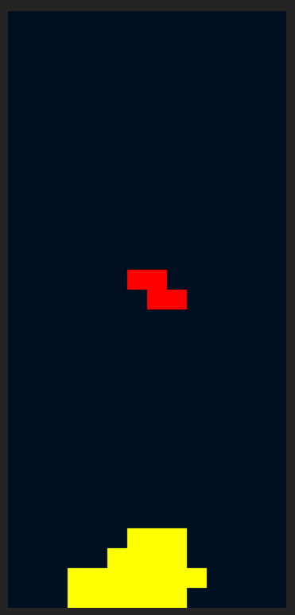
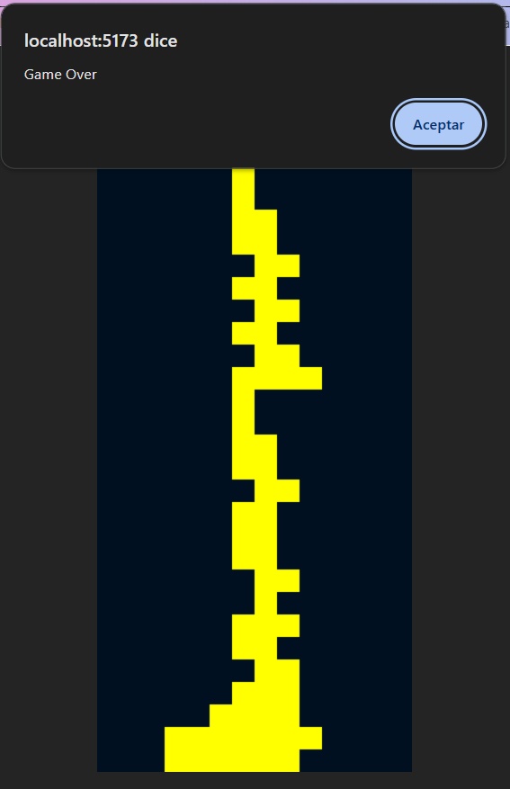

# Tetris

- Juego Tetris realizado con JavaScript en el que va cayendo las figuras de forma aleatoria.
- Se pueden girar con la flecha hacia arriba del teclaado y desplazar hacia la izquierda, derecha y hacia abajo. 
- Tiene presente las colisiones y al chocar con otra figura si la línea está completa elimina esa fila.

    <picture>
      
    </picture>
    <picture>
      
    </picture>

